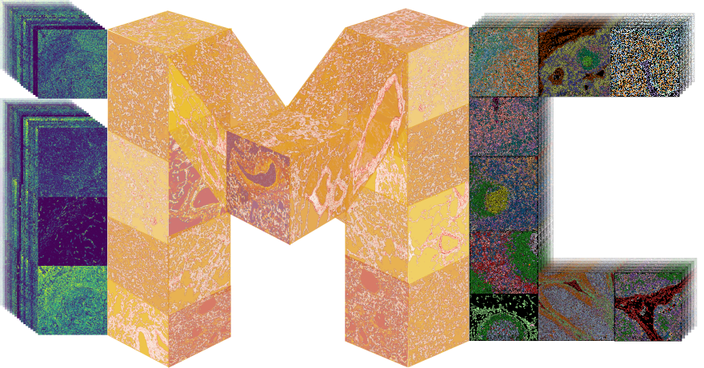

<!---->
<p align="center">
  
</p>

# Imaging mass cytometry

A package for processing and analysis of imaging mass cytometry (IMC) data.

It implements image- and channel-wise quality control, quantification of cell
intenstity and morphology, cell type discovery through clustering, automated
cell type labeling, community and super-community finding and differential
comparisons between sample groups, in addition to many handy visualization tools.
Above all, it is a tool for the use of IMC data at scale.

Development is still underway, so use at your own risk.


## Requirements and installation

Requires `Python >= 3.8`.

Install with `pip`:
```bash
pip install git+https://github.com/ElementoLab/imc.git
```

## Quick start

Install the package:
```bash
# Install imc package (do this inside virtual environment for example)
pip install git+https://github.com/ElementoLab/imc.git#egg=imc[extra]
```

### Use case 1 (pipeline processing)

#### Example: Lung sample processing from MCD to single-cell h5ad

One-line IMC data processing:
```bash
# Run pipeline in one step with remote MCD file
MCD_URL=https://zenodo.org/record/4110560/files/data/20200612_FLU_1923/20200612_FLU_1923.mcd
imc process $MCD_URL
```
`imc` also supports TXT or TIFF files as input, local or remote files:
```bash
# Run pipeline in one step with remote TXT file
TXT_URL=https://zenodo.org/record/5018260/files/COVID19_brain_Patient03_ROI3_COVID19_olfactorybulb.txt?download=1
imc process $TXT_URL
```
Input can be MCD, TIFF, or TXT files.
Several files can be given to `imc process` at once. See more with the `--help` option.

`imc` is nonetheless very modular and allows the user to run any of the step seperately as well.

The above is also equivalent to the following:
```bash
MCD_URL=https://zenodo.org/record/4110560/files/data/20200612_FLU_1923/20200612_FLU_1923.mcd
SAMPLE=20200612_FLU_1923

wget -O data/${SAMPLE}.mcd $MCD_URL

## output description of acquired data
imc inspect data/${SAMPLE}.mcd

## convert MCD to TIFFs and auxiliary files
imc prepare \
  --ilastik \
  --n-crops 0 \
  --ilastik-compartment nuclear \
  data/${SAMPLE}.mcd

## For each TIFF file, output prediction of mask probabilities and segment them 
TIFFS=processed/${SAMPLE}/tiffs/${SAMPLE}*_full.tiff

## Output pixel probabilities of nucleus, membrane and background using ilastik
imc predict $TIFFS

## Segment cell instances with DeepCell
imc segment \
  --from-probabilities \
  --model deepcell \
  --compartment both $TIFFS

## Quantify channel intensity and morphology for each single cell in every image
imc quantify $TIFFS

## Phenotype cells into clusters
imc phenotype processed/quantification.h5ad
```
There are many customization options for each step. Do `imc --help` or `imc <subcommand> --help` to see all.

`imc` also includes a lightweight interactive image viewer:
```bash
imc view $TIFFS
```

There is also an interface to the more full fledged `napari` image viwer:
```bash
imc view --napari data/${SAMPLE}.mcd  # view MCD file
napari $TIFFS  # view TIFF files directly with napari. Requires napari
```

A quick example of further analysis steps of single cell data downstream in IPython/Jupyter notebook:
```python
import scanpy as sc
a = sc.read('processed/quantification.h5ad')
sc.pp.log1p(a)
sc.pp.pca(a)
sc.pp.neighbors(a)
sc.tl.umap(a)
sc.pl.umap(a, color=a.var.index)
```

### Use case 2 (API usage)

#### Demo data (synthetic)
```python
>>> from imc.demo import generate_project
>>> prj = generate_project(n_samples=2, n_rois_per_sample=3, shape=(8, 8))
>>> prj
Project 'project' with 2 samples and 6 ROIs in total.

>>> prj.samples  # type: List[IMCSample]
[Sample 'test_sample_01' with 3 ROIs,
 Sample 'test_sample_02' with 3 ROIs]

>>> prj.rois  # type: List[ROI]
[Region 1 of sample 'test_sample_01',
 Region 2 of sample 'test_sample_01',
 Region 3 of sample 'test_sample_01',
 Region 1 of sample 'test_sample_02',
 Region 2 of sample 'test_sample_02',
 Region 3 of sample 'test_sample_02']

>>> prj.samples[0].rois  # type: List[ROI]
[Region 1 of sample 'test_sample_01',
 Region 2 of sample 'test_sample_01',
 Region 3 of sample 'test_sample_01']

>>> roi = prj.rois[0]  # Let's assign one ROI to explore it
>>> roi.channel_labels  # type: pandas.Series; `channel_names`, `channel_metals` also available
0    Ch01(Ch01)
1    Ch02(Ch02)
2    Ch03(Ch03)
Name: channel, dtype: object

>>> roi.mask  # type: numpy.ndarray
array([[0, 0, 0, 0, 0, 0, 0, 0],
       [0, 0, 0, 0, 0, 0, 0, 0],
       [0, 0, 0, 0, 0, 0, 1, 0],
       [0, 0, 0, 0, 0, 0, 0, 0],
       [0, 2, 0, 0, 0, 3, 0, 0],
       [0, 0, 0, 0, 0, 0, 0, 0],
       [0, 0, 4, 0, 0, 0, 0, 0],
       [0, 0, 0, 0, 0, 0, 0, 0]], dtype=int32)

>>> roi.stack.shape  # roi.stack -> type: numpy.ndarray
(3, 8, 8)

>>> # QC
>>> prj.channel_correlation()
>>> prj.channel_summary()

>>> # Cell type discovery
>>> prj.cluster_cells()
>>> prj.find_communities()

```
#### Demo data (real)
```python
>>> import imc.demo
>>> imc.demo.datasets
['jackson_2019_short', 'jackson_2019_short_joint']

>>> prj = imc.demo.get_dataset('jackson_2019_short')
>>> prj  # type: Project
Project 'jackson_2019_short' with 4 samples and 4 ROIs in total.

>>> prj.samples  # type: List[IMCSample]
[Sample 'BaselTMA_SP41_15.475kx12.665ky_10000x8500_5_20170905_90_88_X11Y5_242_a0' with 1 ROI,
 Sample 'BaselTMA_SP41_25.475kx12.665ky_8000x8500_3_20170905_90_88_X11Y5_235_a0' with 1 ROI,
 Sample 'BaselTMA_SP41_33.475kx12.66ky_8500x8500_2_20170905_24_61_X3Y4_207_a0' with 1 ROI,
 Sample 'BaselTMA_SP41_33.475kx12.66ky_8500x8500_2_20170905_33_61_X4Y4_215_a0' with 1 ROI]

>>> prj.samples[0].channel_labels  # type: pandas.Series
chanel
0                                  Ar80(Ar80)
1                                  Ru96(Ru96)
2                                  Ru98(Ru98)
3                                  Ru99(Ru99)
4                                Ru100(Ru100)
5                                Ru101(Ru101)
6                                Ru102(Ru102)
7                                Ru104(Ru104)
8                            HistoneH3(In113)
9                                EMPTY(Xe126)
10                                EMPTY(I127)
11                           HistoneH3(La139)
...
42                            vWF-CD31(Yb172)
43                                mTOR(Yb173)
44                        Cytokeratin7(Yb174)
45    PanCytokeratin-KeratinEpithelial(Lu175)
46         CleavedPARP-CleavedCaspase3(Yb176)
47                                DNA1(Ir191)
48                                DNA2(Ir193)
49                               EMPTY(Pb206)
50                               EMPTY(Pb207)
51                               EMPTY(Pb208)
Name: BaselTMA_SP41_15.475kx12.665ky_10000x8500_5_20170905_90_88_X11Y5_242_a0, dtype: object
>>> prj.plot_channels(['DNA2', 'Ki67', "Cytokeratin7"])
<Figure size 400x1200 with 12 Axes>
```

#### Your own data

The best way is to have a CSV file with one row per sample, or one row per ROI.
That will ensure additional sample/ROI metadata is passed to the objects and used later in analysis.
Pass the path to the CSV file to the `Project` object constructor:

```python
from imc import Project

prj = Project()  # will search current directory for Samples/ROIs

prj = Project(processed_dir="processed")  # will search `processed` for Samples/ROIs

prj = Project("path/to/sample/annotation.csv", processed_dir="processed")
# ^^ will use metadata from CSV and use the files in `processed`.
```

However, if one is not given, `Project` will search the current directory or the
argument of `processed_dir` for IMCSamples and ROIs.

The `processed_dir` directory can be structured in two ways:
1. One directory per sample.
  - Inside there is a directory `"tiffs"` which contains the stack `"*_full.tiff"`, channel labels
  `"*_full.csv"` and optionally a segmentation `"*_full_mask.tiff"`.

2. All samples in the same directory `processed_dir`.
  - Inside the one directory there are stack `"*_full.tiff"`, channel label `"*_full.csv"` and
  optionally segmentation `"*_full_mask.tiff"` files.

The default is option one. If you choose `2`, simply pass `subfolder_per_sample`:

``` python
prj = Project(subfolder_per_sample=True)
```

The expected files are produced by common preprocessing pipelines such as
[imcpipeline](https://github.com/elementolab/imcpipeline) or [imcyto](https://nf-co.re/imcyto).


## Documentation

Documentation is for now mostly a skeleton but will be expanded soon:

```bash
make docs
```

## Testing

Tests are still very limited, but you can run tests this way:

```bash
pip install pytest  # install testing package
python -m pytest --pyargs imc
```

For data processing, running the example lung data should make sure eveything is running smoothly.
